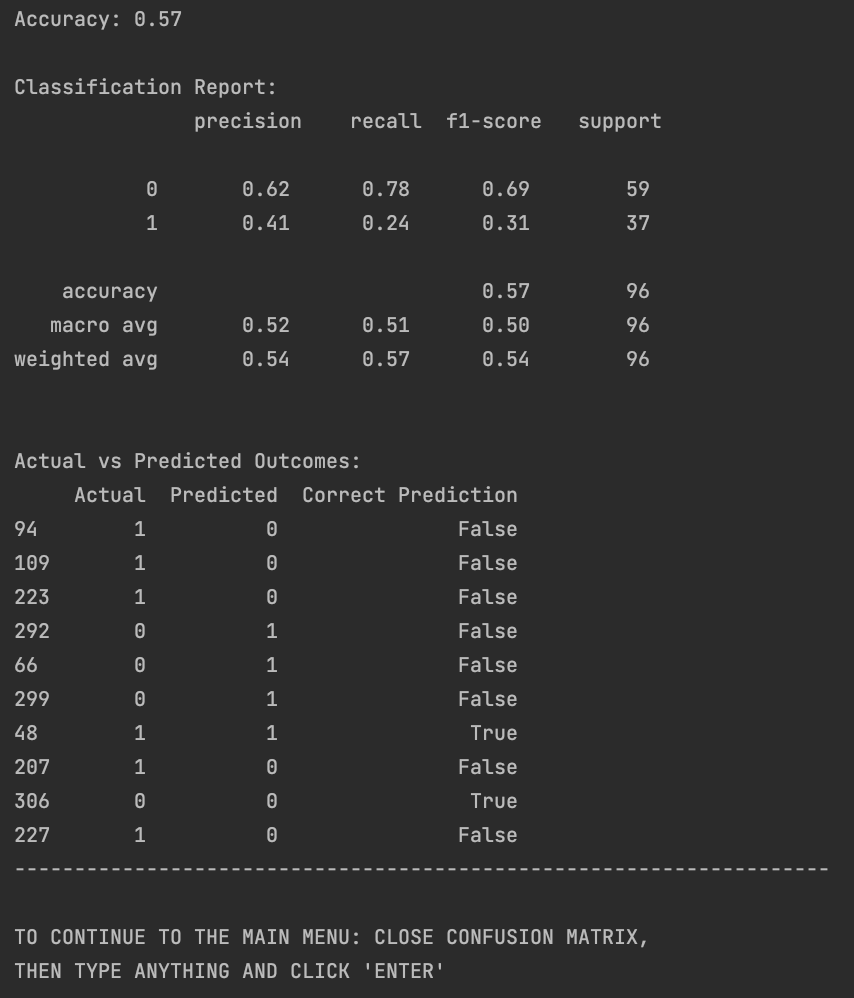
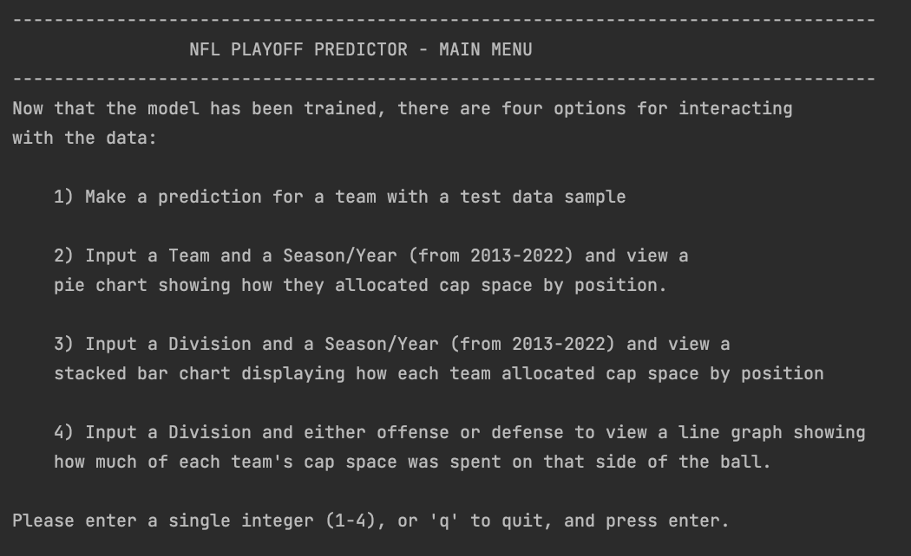

    

 

# NFL Playoff Prediction Machine Learning Application
## Senior Capstone Project by Max Sealey
### (B.S. in Computer Science conferred 06/26/24)

 

## Table of Contents

<ol>

<li style="color:#fff;">Project Overview</li>
<ul>
<li style="color:#fff;">Project Requirements</li>
<li style="color:#fff;">Project Proposal</li>
<li style="color:#fff;">Machine Learning Overview</li>
<li style="color:#fff;">Future Improvements</li>
<li style="color:#fff;">Tech Stack</li>
<ul>
<li style="color:#fff;">Languages</li>
<li style="color:#fff;">Libraries</li>
<li style="color:#fff;">Dataset</li>
<li style="color:#fff;">IDE</li>
</ul>
</ul>
<li style="color:#fff;">Local Environment Setup Instructions</li>
<li style="color:#fff;">Command Line Interface (CLI) Version</li>
<li style="color:#fff;">Graphic User Interface Version (GUI) Version <i>(in-progress)</i></li>

</ol>

## Project Overview

### Project Requirements

-------

<h5 style="text-shadow: none;-webkit-text-stroke: 0px black;color:#fff;">
Design and develop a fully functional data product (application) addressing your identified
business problem or organizational need.   The deliverables include the application and
a written report, also located in this repository. The report contains a Letter of Transmittal to Commissioner Goodell,
a project proposal plan, and a post-implementation report.</h5> 

<h5 style="text-shadow: none;-webkit-text-stroke: 0px black;color:#fff;">
<i>Data Methods</i> – provide <u>one</u> descriptive method that discerns relationships and
characteristics of the past data in at least three forms of visualization. Also, provide <u>one</u>
nondescriptive where a decision or trend could be inferred. The descriptive method
should be in the domains of cluster or association analysis, and the others could include
pruning algorithm, discriminate analysis, regression analysis (linear, logistic), Bayesian
methods, neural network, or support vector machines.
</h5>

<h5 style="text-shadow: none;-webkit-text-stroke: 0px black;color:#fff;">
<i>Datasets</i> – The use of dataset(s) is a critical element and involves the gathering and
measuring of information on targeted variables in a systematic fashion. This could be
student collected (Please consider IRB ramifications.) or publicly accessible such as
websites (e.g. Kaggle.com), governmental (e.g. Department of Labor), or software
related (e.g. GitHub.com).
</h5>

<h5 style="text-shadow: none;-webkit-text-stroke: 0px black;color:#fff;">
<i>Analytics</i> – Using the given data, your application needs to enable decisions to be
formulated or support for given trends to be provided.
</h5>

<h5 style="text-shadow: none;-webkit-text-stroke: 0px black;color:#fff;">
<i>Data Cleaning</i> – if applicable, create a function that will make the data usable prior to
actually being used by the application. Things such as featuring, parsing, cleaning, and
wrangling the datasets.
</h5>

<h5 style="text-shadow: none;-webkit-text-stroke: 0px black;color:#fff;">
<i>Data Visualization</i> – You need at least three real-time (e.g. using the GUI/dashboard)
formats to visualize the data in a graphic format. Look at things like charting, mapping,
color theory, plots, diagrams, or other methods (tables must include heat mapping).
</h5>

<h5 style="text-shadow: none;-webkit-text-stroke: 0px black;color:#fff;">
<i>Real-Time Queries</i> – As part of your GUI enable users to access and manipulate data
real-time including data maintenance. This does not deal with data “freshness” but with
the query response time being in seconds.
</h5>

<h5 style="text-shadow: none;-webkit-text-stroke: 0px black;color:#fff;">
<i>Adaptive Element</i> – if appropriate for the business need, provide the implementation of
machine-learning methods and algorithms to enable the application to improve with
experience.
</h5>

<h5 style="text-shadow: none;-webkit-text-stroke: 0px black;color:#fff;">
<i>Outcome Accuracy</i> – provide functionalities that evaluate the accuracy of the
information/outcomes given by the application. What are the parameters for valid output
data and how will those be checked by the application?
</h5>

<h5 style="text-shadow: none;-webkit-text-stroke: 0px black;color:#fff;">
<i>Dashboard</i> – include a user-friendly, functional dashboard that enables the query and
display of the data, as well as other functionality described in this section. This could be
stand-alone, CLI, Web-based, or a mobile application interface.
</h5> 

### Project Proposal

-----------

<h5 style="text-shadow: none;-webkit-text-stroke: 0px black;">
My application aims to utilize machine learning to assist the NFL in predicting 
the playoff likelihood of any NFL team based on how they allocate their salaries by position. The dataset consists 
of salary cap data from 2013-2022.
</h5> 

### Machine Learning Overview

-----------

<h5 style="text-shadow: none;-webkit-text-stroke: 0px black;">
The ML model chosen is a Random Forest Classification model, a subsect of the Supervised Learning branch of machine learning. The features that I used to make the model included the percentage of the cap allocated to the QB position, the percentage of the cap allocated to the offense (as a whole), and the percentage of the
cap allocated to the defense (as a whole). I then split the data into training and testing subsets (70/30 split) and fit it to a RandomForestClassifier model imported from scikit-learn. Then I had the model make predictions on random samples of the testing data, the results of which were stored and used to formulate the accuracy score, classification report, and the confusion matrix.
</h5> 

### Future Improvements

----------

<h5 style="text-shadow: none;-webkit-text-stroke: 0px black;">
The main improvement I want to make is to increase the accuracy of the application, and that likely includes introducing more data
and adjusting the parameters of the ML model.  Other improvements include:</h5>

<ol>
<li style="color:#fff;">Switching to a Regression model</li>
<li style="color:#fff;">Develop into a web application (frontend UI and backend API)</li>
<li style="color:#fff;">Introduce Ensemble methods</li>
<li style="color:#fff;">More methods to monitor reliability</li>
</ol>

### Tech Stack

----------

<h5 style="text-shadow: none;-webkit-text-stroke: 0px black;">
Languages: <i>Python, SQL (database)</i>  
Libraries: <i>Pandas, Scikit-learn, Matplotlib, NumPy, Seaborn, SQLite</i>  
Dataset: <i>NFL Salary Cap Spending 2013-2022 <a href="https://www.kaggle.com/datasets/lukebukowski/nfl-salary-cap-spending-2013-2022">(link)</a></i>  
IDE: <i>PyCharm 2023.1.12 (Community)</i>
</h5>
 

## Local Environment Setup InstructIons

-------------

<h5 style="text-shadow: none;-webkit-text-stroke: 0px black;">
These instructions assumes that git is installed on your computer and you have a basic knowledge of git and terminal navigation.  
1. Clone the repository to your local machine.
 
</h5>

    git clone <ssh key>

<h5 style="text-shadow: none;-webkit-text-stroke: 0px black;">
2. Open in your chosen IDE. I recommend PyCharm since that is what was used to develop this program.
  3. Install 'pip' if you don't already have it.
  4. Navigate to the project directory and run the following command:

    pip install scikit-learn matplotlib numpy seaborn pandas

</h5>

<h5 style="text-shadow: none;-webkit-text-stroke: 0px black;">
5. Run the program on main.py
</h5>

 

## Command Line Interface (CLI)

-------------

<h5 style="text-shadow: none;-webkit-text-stroke: 0px black;">
Welcome, and thank you for using my program.
</h5>

<h5 style="text-shadow: none;-webkit-text-stroke: 0px black;">
View the classification report, accuracy score, and confusion matrix.
</h5>

<h5 style="text-shadow: none;-webkit-text-stroke: 0px black;">
Classification Report & Accuracy Score
</h5>

<h5 style="text-shadow: none;-webkit-text-stroke: 0px black;">
Confusion Matrix
</h5>

<h5 style="text-shadow: none;-webkit-text-stroke: 0px black;">
Displays the Main Menu for User Interaction
</h5>

<h5 style="text-shadow: none;-webkit-text-stroke: 0px black;">
Option 1: Make a prediction
</h5>

<h5 style="text-shadow: none;-webkit-text-stroke: 0px black;">
Option 2: Pie Chart Visualization
</h5>

<h5 style="text-shadow: none;-webkit-text-stroke: 0px black;">Pie Chart Example</h5>

<h5 style="text-shadow: none;-webkit-text-stroke: 0px black;">
Option 3: Bar Chart Visualization
</h5>

<h5 style="text-shadow: none;-webkit-text-stroke: 0px black;">Bar Chart Example</h5>

<h5 style="text-shadow: none;-webkit-text-stroke: 0px black;">
Option 4: Line Graph Visualization
</h5>

<h5 style="text-shadow: none;-webkit-text-stroke: 0px black;">Line Graph Example</h5>

 

